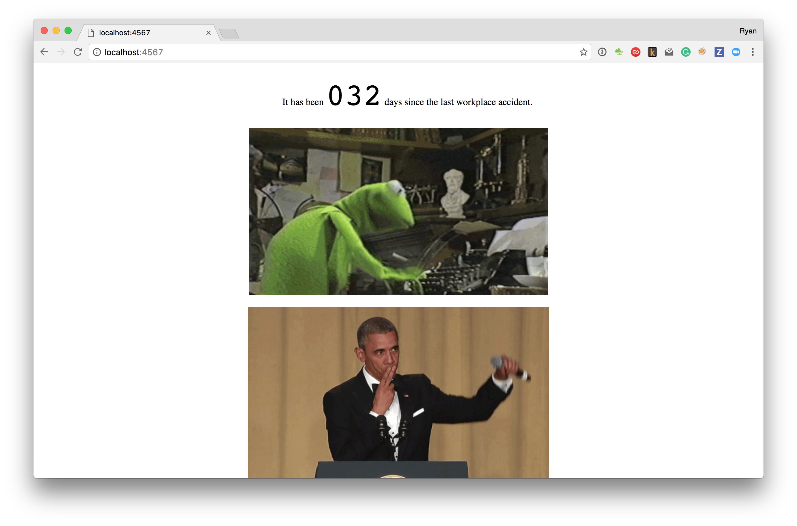
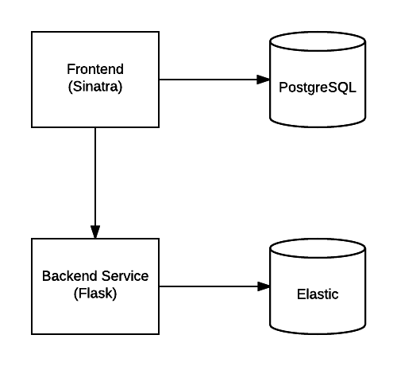

# DevOps Exercise

Shell program for use in Contently's hiring process.


## Running Locally

To run the program locally, [install Docker](https://docs.docker.com/docker-for-mac/). After docker is installed run

```
docker-compose up
```

from the root directory. This should start four containers for the various parts of the application.

To view the user facing portion of the application, go to [http://localhost:4567/](http://localhost:4567/)

```
open http://localhost:4567/
```

This should show something like the following:




## What the Application Does

This application is a combination work-safety-monitor/sentiment-enhancer. It keeps a running count of how many days since the last time we had a workplace injury (stubbed toe) and displays animated gifs.


## Parts of the Application

This application consists of three parts:


1. Postgres database

The database tracks the dates of the last workplace injuries.

```
accidents table:

/---------------\
| accident_date |
+---------------+
|  1999-12-31   |
+----------------
|  2007-07-04   |
+----------------
|      ...      |
+---------------+
```

See [init-database.sh](postgres/init-database.sh) for details.


2. ElasticSearch

An index in elastic search keeps track of our archive of GIFs.

[`GET http://localhost:9200/gifs/_search`](http://localhost:9200/gifs/_search)


3. A backend service writen in Python Flask to serve the GIFs.

[`GET http://localhost:5000/get-gifs`](http://localhost:5000/get-gifs)


4. A front-end that Ruby Sinatra application that brings the days since the last accident and the gifs together.

[http://localhost:4567/](http://localhost:4567/)

## Seeding Data

In the `docker-compose` setup, the Postgres database will be automatically seeded with sample data. The code to do this is in [init-database.sh](postgres/init-database.sh).

ElasticSearch data must be seeded manually. Use the following commands to seed data against ElasticSearch running in `docker-compose`:

```
curl -XPUT "http://localhost:9200/gifs" -d'
{
    "settings": {
        "number_of_shards": 1
    },
    "mappings": {
        "gif": {
            "properties": {
                "url": {
                    "type": "string",
                    "index": "no"
                }
            }
        }
    }
}'
```

```
curl -XPOST "http://localhost:9200/gifs/gif" -d'
{
    "url": "https://media.giphy.com/media/XIqCQx02E1U9W/giphy.gif"
}'
```

```
curl -XPOST "http://localhost:9200/gifs/gif" -d'
{
    "url": "https://media.giphy.com/media/3o7qDEq2bMbcbPRQ2c/giphy.gif"
}'
```

```
curl -XPOST "http://localhost:9200/gifs/gif" -d'
{
    "url": "http://www.gifbin.com/bin/122016/man-punches-kangaroo.gif"
}'
```

```
curl -XPOST "http://localhost:9200/gifs/gif" -d'
{
    "url": "http://p.fod4.com/p/media/3c64c0225d/6AkZwnwSlWQoma2Aa1Lz_Ice%20Skate%20Wall.gif"
}'
```

If you would like to delete the data from ElasticSearch do the following:

```
curl -XDELETE "http://localhost:9200/gifs"
```

## How Everything is Connected

As you might guess, these pieces are connected in the following manner:



The application has Postgres and ElasticSearch datastores. ElasticSearch is used by the back-end service, while Postgres is used by the front-end app. The front-end app calls to the JSON API of the back-end service.

Both the front-end and back-end applications implement a `/ping` endpoint that can be used to see if they are up, such as for use in a load balancer.


## Your Job

The purpose of this exercise is to demonstrate how to setup the infrastructure in a deployed AWS environment using code. You can use whatever tools you want to do this (Chef, Puppet, Terraform, etc.). The system is setup to run locally using Docker as an example. You might use Docker as part of the way the application is deployed, but you don't have to.

A few caveats for how the application should be deployed:

* Frontend is publicly available
* Backend Service is a microservice that is called by Frontend but is not publically accessible
* ElasticSearch and the PostgreSQL database should not be publically accessible

Don’t worry about fancy DNS for any parts of the application, accessing it via IP or Amazon DNS is fine. Feel free to use Amazon managed services (e.g. RDS).


## Purpose of the Exercise

The purpose of the extercise is to understand how you approach the problem, the decisions you make in the infrastructure, and your ability to use code to accomplish things.

Please timebox your effort to 2 to 4 hours. An incomplete solution is not failing the exercise.